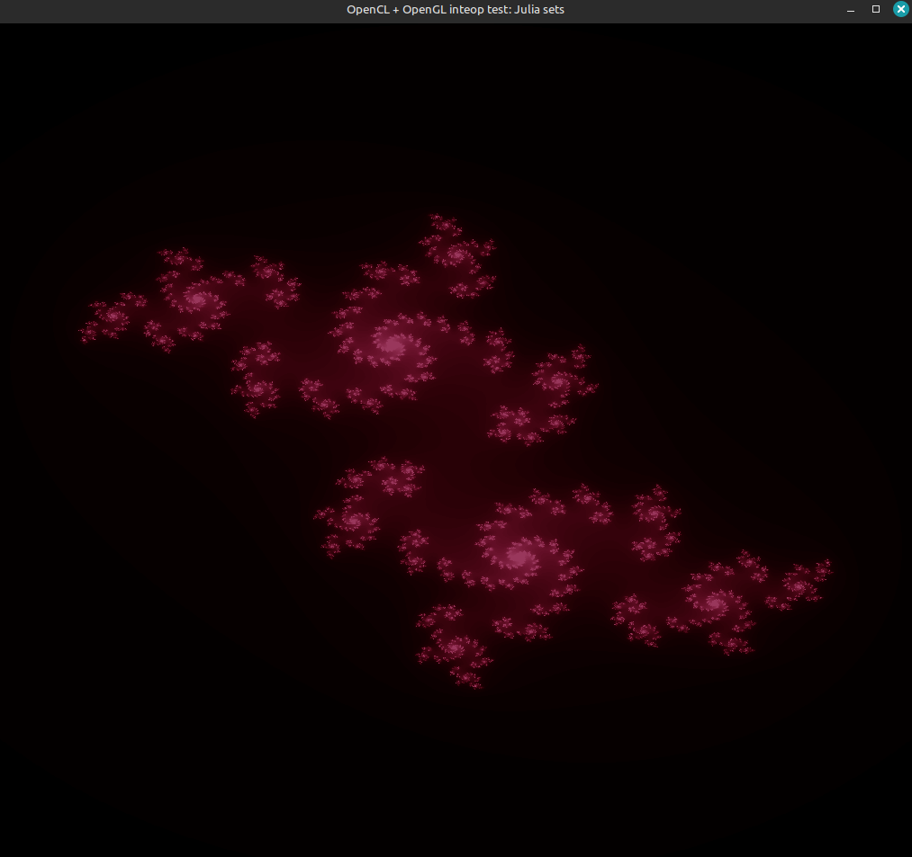
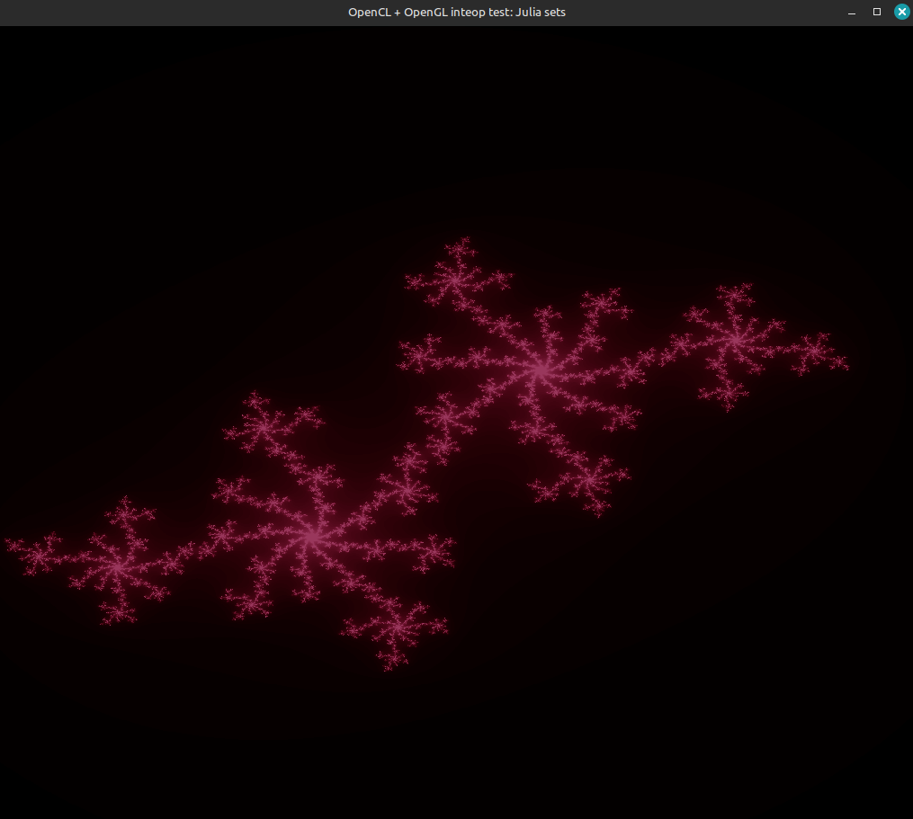
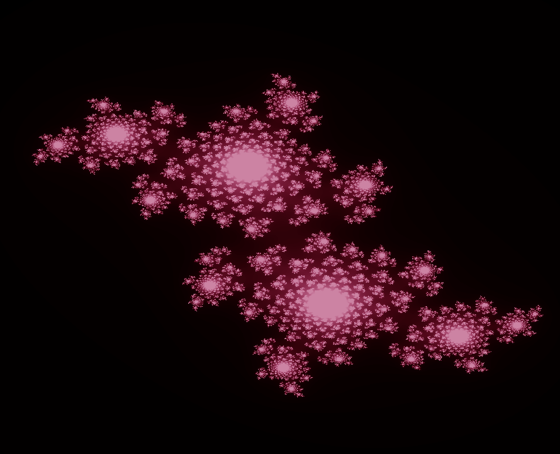

## Julia Sets

The basic mathematic idea is to check the convergence of the sequence:
$$Z_{n+1} = Z_n^2 + C\ \ \ \ \ \ \ C, Z_i \in \mathbb{C}\ \ \ \ \  \forall i \in \mathbb{N}$$
for various values of $Z_0$. This sequence also results in the well known Mandelbrot set.

However in Julia sets, we vary $C$ and plot teh resultant set. $Z_0$ is chosen as the cooridnate of each pixel and its corresponding convergence value is computed in the GPU kernel in parallel for each pixel.

$C$ can be varied using keybindings:
t => Im(C) += Delta
g => Im(C) -= Delta
f => Re(C) -= Delta
h => Re(C) += Delta

Additionally, for movement of the frame:
w, a, s, d => up, left, down, right.
\+, \- => Zoom in, Zoom out


### Pictures
   


### Requirements for running this sim
(This is primarily designed for **my** laptop. I don't really it worth trying to make it cross compatible)
- Linux. There are additional properties that need to be set when creating the context for windows. OpenCL is not supported on Apple.
I dont have the willpower to do it but if you can figure it out, here's where u need to change it:
```cpp
cl_context getContext(cl_platform_id &platform, cl_device_id &dev)
{
    cl_context_properties props[] = {
        CL_CONTEXT_PLATFORM, (cl_context_properties)platform,
        CL_GL_CONTEXT_KHR, (cl_context_properties)glXGetCurrentContext(),
        CL_GLX_DISPLAY_KHR, (cl_context_properties)glXGetCurrentDisplay(),
        0};
    // Other code. The above props need to be changed. glX is for OSX, window has different. Be sure to change the glx header file as well. Top of the file.
}
```
- GPU must support double precision. Just run the program and it will output if your gpu supports double precision.
- OpenCL version 3.0 (You *probably* already have this)
- OpenGL latest(atleast not outdated) version.

### How to run
If you have two gpus, make sure to use the dedicated gpu. Or else OpenCL and OpenGL will create contexts in different GPUs.
For NVIDIA you can do it by typing the following in your console before running the executable to force OpenGL to use the dedicated gpu:
```sh
export __NV_PRIME_RENDER_OFFLOAD=1
export __GLX_VENDOR_LIBRARY_NAME=nvidia
```


To run just do:
```sh
./julia
```

To make changes to the code and compile them:
```sh
g++ core.cpp -o julia -lOpenCL -lGL -lGLEW -lglut -lGLU -lX11 
```


### How the code works:
#### Computation - OpenCL
The main computation happens in the GPU kernel in the file `render_program.cl`

```cpp
__kernel
void find_convergence(write_only image2d_t output,  const double xstart,  const double ystart,  const int countx, const int county,  const double dx, const double dy,  const double cx,  const double cy, const int iterations){
    size_t idx = get_global_id(0);
    size_t idy = get_global_id(1);
    if((idx>=countx)||(idy>=county)) return;
    double x = xstart + dx*(double)idx;
    double y = ystart + dy*(double)idy;
    int iterations_completed = 0;
    while((iterations_completed<iterations) && ((x*x + y*y)<4)){
        const double x_temp = x;
        x = x*x - y*y + cx;
        y = 2*x_temp*y + cy;
        iterations_completed++;
    }

    double res = MAX_RES*BRIGHTNESS_MULTIPLIER*((double)(iterations_completed - 0.0*log2(max(1.0, 0.5*log2(rsq)))))/((double)iterations);

    res = res>MAX_RES ? MAX_RES : (res<0.0 ? 0.0 : res);
    double r = (double)(res);
    double g = (double)(pow(res, 3));
    double b = (double)(pow(res, 2));
    float4 colour = (float4)(r, g, b, 1.0f);
    int2 coord = (int2)(idx, idy);
    write_imagef(output, coord, colour);
}
```

The index of the thread is first found and any out out bound threads are stopped:
```sh
size_t idx = get_global_id(0);
size_t idy = get_global_id(1);
if((idx>=countx)||(idy>=county)) return;
``` 

Then we check if the sequence converges. It can be shown that if the modulus of any sequence element is greater than 2, then it will not converge. 
The res variable is what stores the result. Colour is calculated based on this. It is the fraction of total iterations that it took for solution to cross magnitude of 2.
```sh
    while((iterations_completed<iterations) && ((x*x + y*y)<4)){
        const double x_temp = x;
        x = x*x - y*y + cx;
        y = 2*x_temp*y + cy;
        iterations_completed++;
    }

    double res = MAX_RES*((double)(iterations_completed))/((double)iterations);
```
The colour is then calculated and written to the texture.


The kernel is launched every time they is keyboard input and is responsible for updating the data in case there is any change in orientation.
OpenCL must first get the memory permissions from OpenGL, perform the computation on that memory, and then release it so OpenGL can render it. 
```cpp

void performComputation()
{
    clEnqueueAcquireGLObjects(cmdq, 1, &clImage, 0, NULL, NULL);
    clFinish(cmdq);
    setKernelArgs(kernel, clImage, left, down, countx, county, dx, dy, cx, cy, iterations);
    launchKernel(kernel, cmdq);
    clFinish(cmdq);
    clEnqueueReleaseGLObjects(cmdq, 1, &clImage, 0, NULL, NULL);
    clFinish(cmdq);
}
```


#### Rendering - OpenGL
Magic. IDK what to tell you. It's so verbose and explaining it in a short readme wouldnt really convey what is happening.
TLDR: GPU renders it directly. OpenCL and OpenGL are two APIs that both run on the GPU and so OpenGL creates a 'texture' and allows OpenCL to modify it. GL then 'maps' that texture onto a rectangle.
Since everything happens on the GPU, the data transfer bottleneck which usually exists between CPUs nd GPUs doesnt apply here. The computation power of the GPU and intra-GPU data transfer are the limiting factors. 
In our case, the limiting factor is the precision of the double data type. Despite being slow with double precision, my GPU can handle the computing fast enough to seem immediate. 

The improvement possible would be to implement arbitrary precision units and compute using that, sacrificing speed and sanity for more zoom. 

